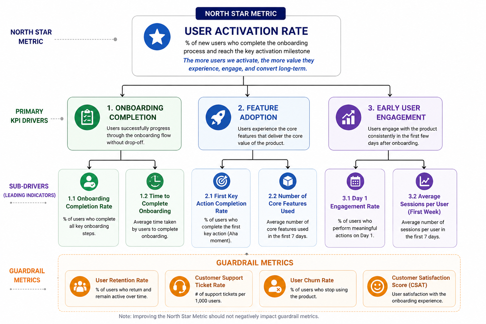

# Task 1
# Business Problem Statement
The company has introduced a new onboarding and activation campaign for its subscription-based digital product. Users were randomly assigned to either:

- **Control Group** – Existing onboarding experience
- **Treatment Group** – New onboarding and activation campaign

## Business Decision

The primary business decision is whether the new onboarding experience should be rolled out to all users.

## Stakeholders Impacted

This decision impacts:

- Product Management Team
- Growth and Marketing Teams
- Customer Success Team
- Business Leadership
- Future Users of the Platform

## Success Metric

The primary objective of the experiment is to improve:

- User Conversion Rate
- User Activation Rate
- Early User Engagement

The treatment group should demonstrate measurable improvement over the control group.

## Risks to Monitor

While increasing conversion and engagement, the company must ensure the new experience does not negatively impact:

- User Retention
- Churn Rate
- Customer Satisfaction
- Support Ticket Volume
- Overall User Experience

These are considered **guardrail metrics** and must remain stable or improve.

## Evidence Required Before Recommendation

Before recommending a full rollout, the following evidence is required:

1. The treatment group performs better than the control group on primary success metrics.
2. The observed improvement is statistically significant.
3. Guardrail metrics do not show negative impact.
4. The expected business value justifies implementation costs.

## Expected Outcome

Based on the experiment results, a recommendation will be made to:

- Roll out the new onboarding experience to all users.
- Continue testing and collect more data.
- Retain the existing onboarding experience.

# Task 2: Define the North Star Metric

# North Star Metric

## Selected North Star Metric

**User Activation Rate**

User Activation Rate is the percentage of users who complete the key activation event during onboarding and reach the point where they experience the core value of the product.

## Why This Is the Main Success Metric

The objective of the experiment is to improve onboarding and early user engagement. Activation is the most important milestone because it measures whether users successfully reach the product's core value after signing up.

A higher activation rate indicates that the onboarding experience is effectively helping users understand and adopt the product. Users who become activated are more likely to engage regularly, convert into paying customers, and remain subscribed over time.

## Why Other Metrics Are Supporting Metrics

While other metrics provide valuable insights, they do not directly measure onboarding success:

- **Conversion Rate:** Measures whether users subscribe or purchase, but does not indicate whether they successfully experienced the product's value.
- **Engagement Metrics:** Show user activity levels but may not reflect successful onboarding.
- **Retention Rate:** Measures long-term success but occurs after activation.
- **Revenue Metrics:** Reflect business outcomes but are influenced by many factors beyond onboarding.

These metrics help validate results but are considered supporting metrics rather than the primary measure of onboarding effectiveness.

## Connection to Business Growth

User activation is strongly connected to business growth because activated users are more likely to:

- Continue using the product.
- Convert to paid subscriptions.
- Remain customers for longer periods.
- Generate higher lifetime value.

Improving activation creates a larger base of engaged users, which contributes directly to revenue growth and customer retention.

## Risks of Optimizing This Metric Blindly

Focusing only on activation rate can create unintended consequences:

- Users may be pushed through onboarding too aggressively, reducing satisfaction.
- The company may prioritize short-term activation at the expense of long-term retention.
- Users could complete activation actions without gaining genuine value from the product.
- Increased activation may lead to higher support requests or customer frustration.
- Artificial improvements in activation may not translate into revenue or retention gains.

For this reason, activation rate should be evaluated alongside guardrail metrics such as retention, churn, customer satisfaction, and support volume before making a rollout decision.

# Task 3: Create KPI Tree

# KPI Tree

## North Star Metric

**User Activation Rate**

Percentage of new users who successfully complete the onboarding process and reach the product's key activation milestone.

### Primary Driver 1: Onboarding Completion

Measures how effectively users progress through the onboarding flow.

Sub-Drivers:
- Onboarding Completion Rate
- Time to Complete Onboarding

### Primary Driver 2: Feature Adoption

Measures whether users interact with the product's core features.

Sub-Drivers:
- First Key Action Completion Rate
- Number of Core Features Used

### Primary Driver 3: Early User Engagement

Measures user interaction shortly after onboarding.

Sub-Drivers:
- Day 1 Engagement Rate
- Average Sessions per User (First Week)

## Guardrail Metrics

These metrics ensure improvements in activation do not negatively affect user experience or business outcomes.

- User Retention Rate
- Customer Support Ticket Rate
- User Churn Rate
- Customer Satisfaction Score (CSAT)

## KPI Tree Layout

# Task 4: CLean and Prepare Experiment data

# Data Cleaning and Preparation

The experiment dataset was reviewed and validated before performing KPI analysis and hypothesis testing.

## Dataset Overview

- **Total Records:** 1,408
- **Total Columns:** 16

### Experiment Groups

| Group | Users |
|---------|-------:|
| Control | 693 |
| Treatment | 715 |

---

## 1. Missing Values Check

### Findings

| Column | Missing Values |
|----------|----------:|
| device_type | 18 |
| traffic_source | 24 |
| engagement_score | 14 |
| days_to_convert | 1,336 |
| All Other Columns | 0 |

### Handling

- Missing values in **days_to_convert** were expected because most users did not convert to paid customers.
- Missing values in **device_type**, **traffic_source**, and **engagement_score** were minimal and documented.
- No missing values were found in critical experiment fields such as:
  - user_id
  - experiment_group
  - completed_onboarding
  - converted_to_paid
  - revenue_30d

---

## 2. Group Count Validation

### Findings

| Group | Users |
|---------|-------:|
| Control | 693 |
| Treatment | 715 |

### Handling

The experiment groups are reasonably balanced, indicating that user allocation between Control and Treatment was performed correctly.

---

## 3. Duplicate User ID Check

### Findings

- **Duplicate User IDs Found:** 8

### Handling

Duplicate user records were identified and flagged for removal before analysis to avoid double-counting users and inflating KPI results.

---

## 4. Invalid Binary Value Check

### Columns Checked

- visited_landing_page
- started_trial
- completed_onboarding
- converted_to_paid
- refund_requested

### Findings

All binary columns contained only valid values:

- **0 = No**
- **1 = Yes**

### Handling

No invalid binary values were found. No corrective action was required.

---

## 5. Revenue Outlier Check

### Findings

Revenue distribution is highly skewed:

- Median Revenue = 0
- 75th Percentile (Q3) = 0
- Maximum Revenue = 8,610.72

A total of:

- **72 users generated revenue**
- **1,336 users generated zero revenue**

Using the standard IQR method:

- Q1 = 0
- Q3 = 0
- IQR = 0

As a result, all positive revenue values are technically flagged as outliers.

### Handling

The positive revenue values represent legitimate paying customers rather than data errors. Therefore, these observations were retained and treated as valid business outcomes.

---

## 6. Segment Distribution Across Groups

### Region Distribution

| Region | Control | Treatment |
|----------|---------:|----------:|
| East | 158 | 172 |
| North | 203 | 180 |
| South | 184 | 184 |
| West | 148 | 179 |

### Device Type Distribution

| Device Type | Control | Treatment |
|-------------|---------:|----------:|
| Desktop | 200 | 214 |
| Mobile | 428 | 436 |
| Tablet | 56 | 56 |

### Traffic Source Distribution

| Source | Control | Treatment |
|----------|---------:|----------:|
| Email | 74 | 56 |
| Organic | 246 | 241 |
| Paid Search | 156 | 176 |
| Referral | 81 | 91 |
| Social | 130 | 133 |

### Plan Type Distribution

| Plan Type | Control | Treatment |
|------------|---------:|----------:|
| Free | 361 | 368 |
| Basic | 223 | 235 |
| Premium | 109 | 112 |

### Handling

The segment distributions are generally balanced between the Control and Treatment groups. No significant allocation bias was observed.

---

# Data Quality Summary

| Check | Result | Action Taken |
|---------|---------|---------|
| Missing Values | Limited missing values identified | Documented and retained where appropriate |
| Group Counts | Balanced groups | No action required |
| Duplicate User IDs | 8 duplicates found | Flagged for removal before analysis |
| Invalid Binary Values | None found | No action required |
| Revenue Outliers | Revenue highly skewed | Retained as valid business outcomes |
| Segment Distribution | Generally balanced | No action required |

## Conclusion

The dataset passed all major data quality checks. After removing duplicate user records, the data was considered suitable for experiment analysis, KPI evaluation, and hypothesis testing.

# Task 5: Create Experiment Summary 

# Experiment Summary: Control vs Treatment (After Removing Duplicates)

| Metric                             | Control | Treatment | Difference |
|------------------------------------|--------:|----------:|-----------:|
| User Count                         | 690 | 710 | +20 |
| Landing Page Visit Rate            | 63.62% | 72.39% | +8.77 pp |
| Trial Start Rate                   | 25.07% | 29.01% | +3.94 pp |
| Onboarding Completion Rate         | 15.65% | 21.13% | +5.48 pp |
| Paid Conversion Rate               | 3.19% | 7.04% | +3.85 pp |
| Average Revenue Per User (ARPU)    | 51.97 | 54.25 | +2.28 |
| Average Revenue Per Converted User | 1,630.10 | 770.41 | -859.69 |
| Refund Rate                        | 0.00% | 0.42% | +0.42 pp |
| Support Ticket Rate                | 14.78% | 24.79% | +10.01 pp |
| Average Engagement Score           | 57.03 | 62.94 | +5.91 |
| Average Days to Convert            | 8.86 | 6.40 | -2.46 days |

## Key Observations

- After removing duplicate users, the Treatment group continues to outperform the Control group across all primary funnel metrics.
- Landing page visit rate increased from **63.62%** to **72.39%**.
- Trial start rate improved from **25.07%** to **29.01%**.
- Onboarding completion rate increased from **15.65%** to **21.13%**.
- Paid conversion rate more than doubled, increasing from **3.19%** to **7.04%**.
- Average revenue per user increased from **51.97** to **54.25**.
- Average engagement score improved significantly from **57.03** to **62.94**.
- Users in the Treatment group converted faster, reducing average conversion time from **8.86 days** to **6.40 days**.
- Support ticket rate increased substantially from **14.78%** to **24.79%**, indicating a potential usability or support burden that should be investigated.
- Refund requests remained very low, although they occurred only in the Treatment group.

## Data Cleaning Impact

- Original Records: **1,408**
- Duplicate User IDs Removed: **8**
- Final Unique Users: **1,400**
  - Control: **690**
  - Treatment: **710**

All subsequent analyses, KPI calculations, and business recommendations should be based on the deduplicated dataset.